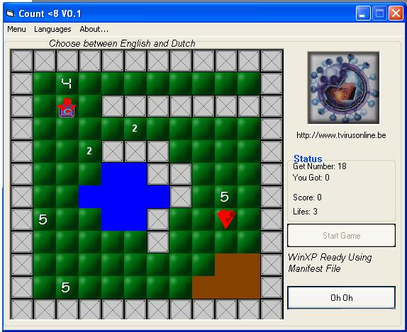

<div align="center">

## Count\.


</div>

### Description

This is a small game I created for some people that wre asking for it.. It is for kids age 6 and up... Kinda slow on old computers cause its using my own, easy bitblit function :)

Nice engine... For a start .. Could be extended... First project commented :) Rate this please ...
 
### More Info
 


<span>             |<span>
---                |---
**Submitted On**   |2002-04-11 21:57:10
**By**             |[TV2kNET\.net](https://github.com/Planet-Source-Code/PSCIndex/blob/master/ByAuthor/tv2knet-net.md)
**Level**          |Beginner
**User Rating**    |4.3 (13 globes from 3 users)
**Compatibility**  |VB 6\.0
**Category**       |[Games](https://github.com/Planet-Source-Code/PSCIndex/blob/master/ByCategory/games__1-38.md)
**World**          |[Visual Basic](https://github.com/Planet-Source-Code/PSCIndex/blob/master/ByWorld/visual-basic.md)
**Archive File**   |[Count\_711394112002\.zip](https://github.com/Planet-Source-Code/tv2knet-net-count__1-33710/archive/master.zip)

### API Declarations

```
' See in zip
```


